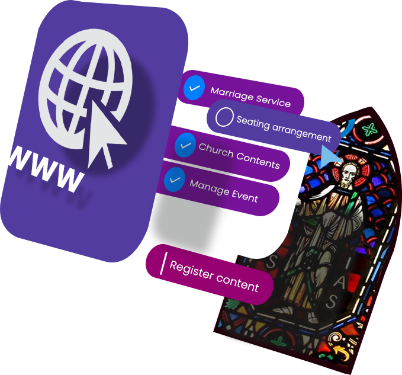

<div align='center'>



</div>

# About this project

> ⚠️ This project is a capstone project but is open for contribution! ⚠️

This is a serverless capstone project which is an OMS or operation management system.
The capstone introduces a dynamic cms which church goers can reserve a seat for a
particular church service on their preferred data and time.

### The project uses the following technologies.

```
Styles
[x] Material UI
[x] SCSS

Front-end
[x] React JS

Database
[x] Firebase

Mobile
[x] React Native
```

### Live DEMO

[Hesoyam-oms](https://www.hesoyam-ch.com/)

### Contributing Guide

1. Fork thisand clone your fork.
2. Create a new branch for your changes:

```sh
$ cd your_cloned_fork
$ git checkout dev
$ git checkout -b my-new-branch
$ npm i
```

**Note: We suggest making an issue first for heavy modification**
